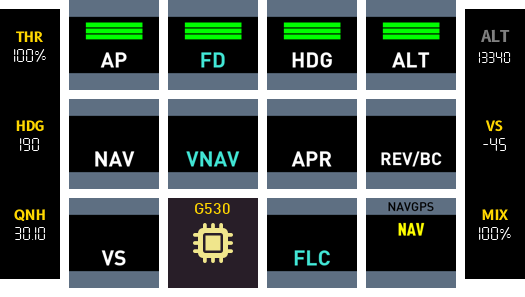
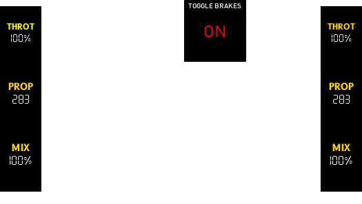

# Beechcraft Baron 58

MTOW 5,400 lbs
{: .label .label-green }

Cruise 197 kts
{: .label .label-green }

Fuel Type AVGAS
{: .label .label-green }

Load 5
{: .label .label-green }


{: width="100" }
{: width="100" }
{: width="100" }
{: width="100" }
{: width="100" }
{: width="100" }
{: width="100" }
{: width="100" }
{: width="100" }

----

## Overview
Deck consists of 7 pages which can be accessed via the lower hardware numbered button.

1
{: .label .label-green }
2
{: .label .label-blue }
3
{: .label .label-red }
4
{: .label .label-yellow }
5
{: .label .label-green }
6
{: .label .label-red }
7
{: .label .label-yellow }


1. PFI (Primary flight instruments)
2. Switches (Battery, alternator, lights etc)
   1. Icing
   2. Lights
3. FCU (Provides autopilot functions)
4. Radio (ADF, COM/NAV functions)
5. Engine (Displays engine data)
6. Pedestal (Flaps, gear)
7. Transponder (Change transponder mode and id)

----

## Supported Variants 
- [x] Cessna_172SP_G1000
- [x] Cessna_172SP_seaplane
- [x] Cessna_172SP

{: .highlight }
Additional buttons were added to support the additional G1000 AP functions (FD/VNAV/FLC).

## Primary Instrument Display


### Airspeed Indicator
*Displays speed in knots.*

### Heading
*Displays magnetic bearing.*

### Altimeter
*Displays altitude and barometer setting.*

### Vertical Speed
*Displays vertical speed.*

### Fuel Quantity
*Displays fuel remaining in left and right tank.*

Fuel is in kg and is converted to gallons using RPN 0.264172 *

### EGT and Fuel Flow
*Displays exhaust gas temperature and fuel flow.*

### Oil
*Displays oil temperature and pressure.*

### Vacuum/Pressure and Battery Ammeter
*Displays vaccuum pressure (necessary for operating of air driven instruments) and displays battery current (positive indicates charging, negative depleting).*

### Propeller Speed
*The propeller speed in RPM. Engine RPM is also the same given that it is direct drive.*

### Caution Annunciators
*Displays oil pressure and voltage caution annunciators.*

### Warning Annunciators
*Displays fuel pressure and vacuum pressure warning annunciators.*

### NAVGPS mode
*Display for navigation mode and also a push button to toggle between NAV (VLOC) and GPS.*

### Next Waypoint
*If there is a flight plan being followed this button will display data related to the next waypoint e.g. nautical miles left, desired track (bearing) and ETA in minutes.* 


## Switch Panel

{: width="200" }
{: width="200" }
{: width="200" }


### Ignition
*Starter motor long press push button.*

PythonPlugin required for long press button (<X-Plane Path>/Resources/Plugins/PythonPlugins/PI_cockpitdecks_helper.py)

### Alternator
*On/off button for alternator (when engine is running provides power to systems and charges battery).*

### Battery
*On/off button for battery (provides power when engine is not running).*

### Fuel Pump
*On/off button for electric fuel pump. Used for priming engine before start (also substitutes mechanical pump in case of a failure).*

### Beacon
*On/off for rotating beacon light.*

### Landing lights
*On/off button for landing light.*

### Taxi lights
*On/off button for taxi light.*

### Navigation lights
*On/off button for navigation lights (wings/tail).*

### Strobe Lights
*On/off button for strobe lights (wing).*

### Pitot Heat
*On/off button for pitot tube heater.*

### Avionics Bus 1
*On/off button to power BUS1.*
- Comm Panel
- G530 GPS
- Transponder
- Autopilot
- BUS2

### Avionics Bus 2
*On/off button to power BUS2.*
- G430 GPS
- VOR2
- ADF

## Flight Control Unit (FCU)


### AP
Engages or disengages the autopilot system.

### FD
*Not available on S-TEC 55 Autopilot model.*
Provides visual cues for manual flight control based on autopilot logic without actually controlling the aircraft.

### HDG
Heading mode. Autopilot turns the aircraft to heading selected via Heading Bug knob.

### ALT
Altitude mode holds the current altitude.

### NAV
Directs aircraft heading according to flight plan programmed into GPS (GPS mode) or to/from a radio navigation aid (VLOC mode).

### VNAV
*Not available on S-TEC 55 Autopilot model.*
Manages aircraft's vertical path according to a predefined route or waypoint altitudes

### APR
Activates an Instrument Landing System (ILS) approach mode for precision guidance during landing approaches.

### REV/BC
Engages mode for flying an ILS localiser back-course approach, used for approaches where the aircraft is flying away from the beacon.

### VS
Vertical speed mode to maintain an ascent or descent rate.

### FLC
*Not available on S-TEC 55 Autopilot model.*
Maintains a set airspeed while climbing or descending to a selected altitude.


{: .note }
> Some functions are not available on S-TEC 55 Autopilot (Cessna 172 G530 model).


# Radio functions


## ADF FREQ
Displays ADF frequency and ADF standby frequency
Pressing button will swap frequencies.

## COM 1
Displays COM1 frequency and COM1 standby frequency.
Pressing button will swap frequencies.

## VLOC 1
Displays NAV1 frequency and NAV1 standby frequency.
Pressing button will swap frequencies.


{: .highlight }
Transponder functions will be deprecated after moving to a new page.


# Engine


## ENG RPM
Displays engine/prop RPM.

## MANIFOLD PRESSURE
Displays manifold pressure.

## OIL TEMP
Displays oil temperature.

## OIL PRESSURE
Displays oil pressure.

## FUEL FLOW
Display fuel flow in GPH.

```fuel_flow_kg_sec 3600 * 0.8 / 3.78541 / 2 roundn```

## CHT
Displays cylinder head temp in celsius.

## BATTERY
1. Displays battery charge in watts per hour.
2. Displays battery amps (negative value means battery is discharging)

## THROTTLE
Displays throttle as a percentage.

## FUEL EST
Provides an estimate on fuel remaining in hours, based on current fuel flow.

```fuel_flow_kg_sec[0]} 3 roundn 0.000001 + / 3600 / 1 roundn```

## MIXTURE
Displays fuel mixture as a percentage.


# Pedestal


## THROTTLE
Displays throttle as a percentage.

## TOGGLE BRAKES
Displays state of the parking brake. Push will toggle parking brake on/off.

## MIXTURE
Displays fuel mixture as a percentage.

## FLAPS UP
Extends flaps one notch.

## FLAPS RATIO
Displays flaps state as a number between 0 and 1 (0 fully retracted, 1 fully extended).

## FLAPS DOWN
Detracts flaps one notch.


# Transponder


## SQUAWK CODE BUTTONS
The top four buttons display the squawk code. They also serve as push buttons to increment the transponder digits.

## Transponder Mode Buttons
1. ON
2. OFF
3. STBY
4. ALT
5. TEST

## IDENT
Transmits radio beacon for a short period of time.

## RADIO BEACON
Displays an R if the transponder is broadcasting. This will display intermittently or constantly for short period of time if IDENT is pushed. 

## MODE
Displays current mode of the transponder.